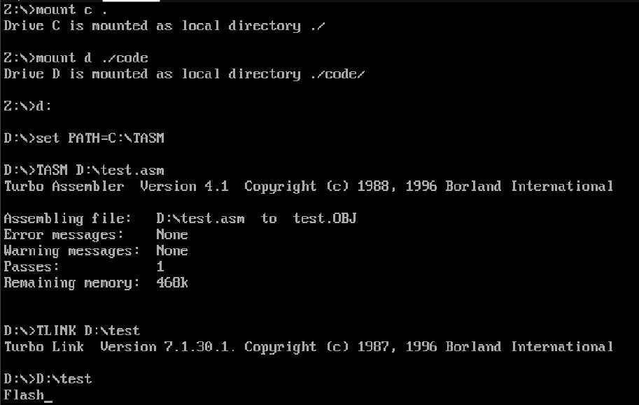

# Assembly
Sistemas Embarcados

[Marie.js](https://marie.js.org/)

## Como funciona a alocação de memória dinâmica para armazenar o nome


Este programa em Assembly simula a atribuição de valores às posições de memória para armazenar o nome "Flásh".

1. `ORG 000`: Define o endereço de origem do programa como 000.
2. `Load F`: Carrega o valor hexadecimal 46 (que corresponde à letra 'F') no acumulador.
3. `Store NAME_S`: Armazena o valor atual do acumulador na posição de memória indicada por `NAME_S`.
4. Repete os passos 2 e 3 para cada letra do nome "Flásh", armazenando-as em posições de memória diferentes (`NAME_A`, `NAME_M`, `NAME_U`, `NAME_E`).
5. `Halt`: Encerra a execução do programa.

Assim, ao final da execução, cada posição de memória `NAME_X` conterá o valor hexadecimal correspondente à letra do nome "Flásh". No entanto, esse código não representa a alocação dinâmica de memória. A alocação dinâmica de memória geralmente envolve solicitar memória durante a execução do programa, o que não parece ser o caso aqui. Neste código, as posições de memória já estão definidas estaticamente.


```assembly
ORG 000 /inicia o programa no endereço 000

Load F
Store NAME_S
Load l
Store NAME_A
Load a
Store NAME_M
Load s
Store NAME_U
Load h
Store NAME_E

Halt / Termina a execução
F, HEX 46
l, HEX 6C
a, HEX 61
s, HEX 73
h, HEX 68

NAME_S, HEX 0
NAME_A, HEX 0
NAME_M, HEX 0
NAME_U, HEX 0
NAME_E, HEX 0
```


## Atividade 2

### DOS em Assembly
O DOS (Disk Operating System) aplicado em Assembly refere-se à prática de programar para o sistema operacional DOS usando linguagem Assembly. Nesse contexto, os programadores escrevem código Assembly para realizar tarefas específicas, como interagir com o sistema de arquivos, controlar dispositivos de hardware e criar interfaces de usuário simples. A programação Assembly no DOS oferece um controle direto sobre o hardware do computador, permitindo um desempenho otimizado e uma utilização eficiente dos recursos limitados disponíveis nos sistemas DOS.

```assembly
.MODEL small ;Define o modelo de memória small
.STACK 64 ;Aloca um espaço de 64 bytes para a pilha

.DATA                          ;Inicio da seção de dados

    message db 'Flash', '$'    ;Define uma mensagem e termina com cifrão

.CODE                              ;Inicio da seção de código
main proc                          ;Define o inicio do procedimento principal

         mov ax, @data             ;Carrega o endereço do segmento em AX
         mov ds, ax                ;Move o valor em AX para o registrador DS

         mov ah, 9h                ;Prepara o registrador AH para a função 09h do DOS
         mov dx, offset message    ;vai fazer o deslocamento da msg em DX

         int 21h                   ;Intrução de Interrupção

main endp                          ;Marca o fim do ponto
end main ;Indica o fim
```

## Explicação do código e dos Registradores

1. **AX**:
   - Registrador geral de 16 bits, frequentemente usado para várias operações.
   - `mov ax, @data`: Carrega o endereço do segmento de dados na memória em AX.

2. **DS** (Data Segment Register):
   - Registrador de segmento de dados usado para acessar dados na memória.
   - `mov ds, ax`: Move o conteúdo de AX para DS, permitindo que o segmento de dados seja acessado corretamente.

3. **AH** e **DX**:
   - **AH** é o byte superior do registrador AX e **DX** é um registrador de dados de 16 bits.
   - `mov ah, 9h`: Define o valor 9h (hexadecimal) em AH, indicando que a função de impressão de string será chamada.
   - `mov dx, offset message`: Carrega o endereço efetivo da mensagem na memória em DX. `offset` é uma diretiva que retorna o deslocamento do operando.
   
4. **INT 21h**:
   - Esta é uma interrupção de software que chama uma função do DOS.
   - O valor em AH (9h) indica qual função do DOS será executada.
   - O registrador DX pode conter um endereço para uma string, que é o caso aqui. Ele aponta para a mensagem que será impressa na tela.

   # Saída do Código

   
